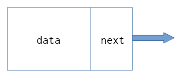
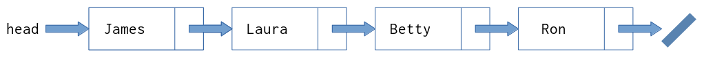
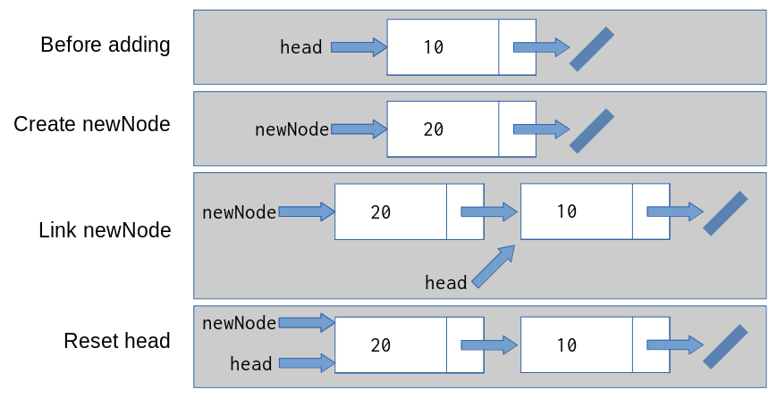
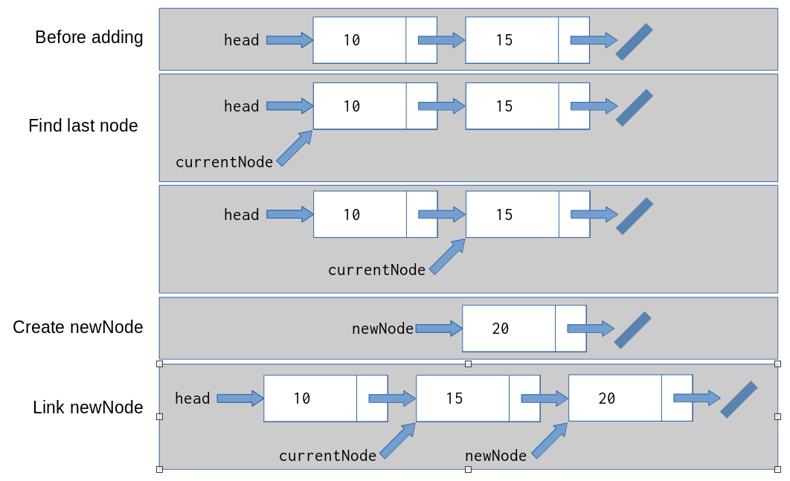

# Linked Lists

## So what's the problem with arrays?

Arrays and associative arrays are great for storing large amounts of data, indexed by an integer or a key. However, they have some drawbacks.

The first is that arrays are _statically sized_. The size is defined when the code is written. When you declare an array, you also declare how big the array should be, and the array will only hold that much data.

You can resize the array, but that is a costly procedure. Data in arrays are _contiguous_, meaning that `array[2]` lives in memory right next to `array[3]`. This makes accessing items in the array very fast, but also makes resizing the array difficult. Resizing the array means finding a single large block of memory which can hold the new size of the array, which may require moving other items around in memory.

Overcoming these difficulties is where _linked lists_ come in.

## The Linked List

A _linked list_ is list of data, where each item in the list contains the data to bew stored **and** a link to the next item in the list. Conceptually, it looks like this:



Each item in a linked list is called a _node_. Each node contains:

- The data being stored (called `data`)
- A link to the next node (called `next`)

In Java, a linked list class might look like this:

```java
class Node<T>
{
    T data;
    Node<T> next;
}
```

The first node in a linked list is called the _head_, and is the starting point for all operations on the list. Normally, the head is the only node stored explicitly in a program --- all other nodes are accessed from it:



Because the amount of data a linked list can store grows and shrinks dynamically as the program runs, it is an example of a _dynamic data structure_.

## Using a Linked List

Linked lists are often used in place of an array where the amount of data being stored is unknown. So let's compare some common array operations with the same operations on a linked list.

For simplicity, we'll store `int` values only, and use the following definitions:

```java
// For the array
int[] datastore = new int[10];

// For the linked list
class Node{
    int data;
    Node next;

    Node(int data){
        // Store the data
        this.data = data;
        // There is nothing after this
        this.next = null;
    }
}

Node head = null;
```

Note that the `datastore` array can immediately hold up to ten (10) integers. On the other hand, the linked list is defined but no space has been set aside for data yet.

### Adding Data

Adding data to an array requires knowing an index to store the data:

```java
if (index >=0 && index < datastore.length())
    datastore[index] = data;
else
    throw IndexOutOfBoundsException;
```

If the `index` is beyond the bounds of the array, you throw an exception. Otherwise, you store the data. Note that this may overwrite data already at that index, which may cause a logic or runtime error later.

For the linked list, things are a little easier:

```java
newNode = new Node(data);
newNode.next = head;
head = newNode;
```

You first create a new `Node`, storing the `data` in that node. You then set `next` of the new node to the current `head` node, in effect linking them together. Lastly, we set `head` to the new node, making our new data the first thing in the list.

Conceptually, this operation looks like this:



But what if you wanted to add the new data at the end of the list? With arrays, this is easy:

```java
lastIndex = datastore.length() - 1;
datastore[lastIndex] = data;
```

To do the same thing with a linked list, you first need to _find_ the end of the list:

```java
// Which node are we looking at
currentNode = head;

// Look for the next node, until there isn't a next node
while (currentNode.next != null){
    currentNode = currentNode.next
}

// currentNode is now the last node in the list
// So create the new node and link it to the last node
newNode = new Node(data);
currentNode.next = newNode;
```

Conceptually, this looks like this:



Using the variable `currentNode` to inspect each item in the list in a `while` loop is a technique called _walking the list_. You'll use this technique often when working with linked lists.

There is one last way to add items to a linked list, and that's adding something in the middle of the list.

It's important to note that while adding data to a linked list is more complex, you are actually _inserting_ data and not overwriting it, as you are with an array.

